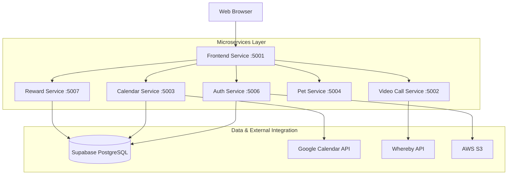

# AIDA: Assisted Independent Daily Activities

## Project Overview
AIDA is a cloud-native microservices-based system designed to support Persons with Intellectual Disability (PWIDs) in completing and tracking Activities of Daily Living (ADLs) such as self-care routines and household tasks. The system empowers users through gentle guidance, smart reminders, and engaging digital interactions—including a virtual pet motivator and a rewards mechanism that reinforces consistent task completion.

Beyond supporting PWIDs, AIDA provides MINDS staff and volunteers with robust tools to manage client profiles, configure personalized task support, and provide real-time assistance via video and voice communication. Built with a modular and scalable architecture, AIDA is designed for long-term usability, ethical AI integration, and flexible deployment across various care environments.

## Problem Statement
PWIDs often face significant challenges in managing daily routines independently, which can impact their autonomy and overall well-being. Existing monitoring solutions often rely on invasive methods (e.g., constant camera surveillance) that compromise privacy and dignity within the home.

**AIDA addresses this central challenge:**
> How might we use technology to support and empower PWIDs in completing and tracking their daily tasks, without unnecessarily infringing on the privacy of their home environment?

## Architecture & Architecture Decision Records (ADR)
AIDA utilizes a cloud-native microservices architecture to ensure high availability, fault isolation, and the ability to scale components independently.

### System Architecture




### Architectural Decisions
- **Gateway Pattern**: The `Frontend-service` acts as a reverse proxy, centralizing request routing and simplifying client-side API configuration.
- **Stateless Authentication**: JWT (JSON Web Tokens) are used across all services to ensure secure, stateless communication.
- **Service Isolation**: Each core feature (Auth, Calendar, Video, etc.) is encapsulated in its own service, allowing for independent updates and technological flexibility.


## Key Features
 
- 🐾 **Digital Pet Motivator**: An interactive virtual pet that encourages task completion and reflects the user's progress through its mood and evolution.
- 📅 **Smart Task Management**: Personalized task scheduling and real-time tracking of Activities of Daily Living (ADLs).
- 🤖 **AI-Assisted Guidance**: Intelligent nudges and conversational support to help users stay on track with their routines.
- 🎁 **Gamified Rewards**: Users earn points for completing tasks, which can be redeemed for real-world or digital rewards.
- 📹 **Remote Support**: Secure video and voice communication for real-time assistance from staff or caregivers.
- 🎨 **Accessibility-First Design**: A clean, glassmorphism-inspired UI designed specifically for ease of use and cognitive clarity.


## Tech Stack
- **Frontend**: Modular HTML5, Vanilla JavaScript (ES6+), CSS3 (Modern Glassmorphism Design)
- **Backend**: Node.js, Express.js
- **Database**: PostgreSQL (hosted via Supabase)
- **Containerization**: Docker, Docker Compose
- **Key Integrations**:
    - **Whereby**: Powering secure video communication between staff and clients.
    - **AWS SDK (S3)**: For reliable storage of user profile images.
    - **JWT**: For secure, role-based access control.

## Assumptions / Limitations
- **Stakeholder Involvement**: We assume MINDS staff will carry out regular check-ins with the PWIDs at their accommodation to ensure their well-being and safety.
- **Connectivity**: Users are assumed to have access to a basic digital device and stable internet connectivity.
- **Self-Reporting**: Task completion is currently self-reported. The system intentionally avoids intrusive monitoring (sensors/cameras) to prioritize user privacy.
- **AI Integration**: AI features are strictly assistive and supportive, designed to aid decision-making rather than act autonomously.
- **Prototype Status**: The system is a functional prototype and may require further performance tuning for large-scale production deployment.

## Setup Instructions
1. **Clone the repository**
   ```bash
   git clone https://github.com/HRx88/AIDA.git
   cd AIDA
   ```
2. **Environment Configuration**
   Create a `.env` file in the root directory and populate it with the following variables. These are shared across all microservices:

   ```env
   # Database (Supabase PostgreSQL)
   SUPABASE_USER=postgres
   SUPABASE_PASS=your_password
   SUPABASE_HOST=db.your-project.supabase.co
   SUPABASE_DB=postgres

   # Security
   JWT_SECRET=your_super_secret_jwt_key

   # Service Ports
   FRONTEND_PORT=5001
   VIDEO_SERVICE_PORT=5002
   CALENDAR_SERVICE_PORT=5003
   PET_SERVICE_PORT=5004
   AUTH_SERVICE_PORT=5006
   REWARD_SERVICE_PORT=5007

   # Video Communication (Whereby)
   WHEREBY_API_KEY=your_whereby_api_key

   # Storage (AWS S3)
   AWS_ACCESS_KEY_ID=your_aws_access_key
   AWS_SECRET_ACCESS_KEY=your_aws_secret_key
   AWS_S3_REGION=ap-southeast-1
   AWS_S3_BUCKET=your-bucket-name

   # Google Calendar Integration
   GOOGLE_CLIENT_ID=your_google_client_id
   GOOGLE_CLIENT_SECRET=your_google_client_secret
   GOOGLE_REDIRECT_URI=http://localhost:5001/calendar/api/google-calendar/callback
   ```

3. **Build and Run**
   ```bash
   docker-compose up --build
   ```
4. **Access the Application**
   The frontend is accessible at `http://localhost:5001`.

### Database Schema

Run the following SQL script in your database (e.g., Supabase SQL Editor) to set up the required tables and test data:

```sql
-- ==========================================
-- 1. DROP EXISTING TABLES (Reset)
-- ==========================================
DROP TABLE IF EXISTS reward_redemptions;
DROP TABLE IF EXISTS user_points;
DROP TABLE IF EXISTS task_logs;
DROP TABLE IF EXISTS tasks;
DROP TABLE IF EXISTS schedules;
DROP TABLE IF EXISTS video_calls;
DROP TABLE IF EXISTS rewards;
DROP TABLE IF EXISTS users;

-- ==========================================
-- 2. CREATE CORE TABLES
-- ==========================================

-- Users Table
CREATE TABLE IF NOT EXISTS users (
    id SERIAL PRIMARY KEY,
    username VARCHAR(50) UNIQUE NOT NULL,
    email VARCHAR(255), -- Added column
    password_hash VARCHAR(255) NOT NULL,
    full_name VARCHAR(100),
    role VARCHAR(20) NOT NULL CHECK (role IN ('staff', 'client', 'admin')),
    profile_image_url TEXT,
    accessibility_settings JSONB DEFAULT '{}',
    created_at TIMESTAMP DEFAULT CURRENT_TIMESTAMP
);

-- Rewards Table
CREATE TABLE IF NOT EXISTS rewards (
    id SERIAL PRIMARY KEY,
    name VARCHAR(120) NOT NULL,
    description TEXT,
    cost_points INTEGER NOT NULL,
    stock INTEGER,
    fulfilment_type VARCHAR(20) NOT NULL DEFAULT 'pickup',
    pickup_location VARCHAR(255),
    image_url TEXT,
    is_active BOOLEAN NOT NULL DEFAULT TRUE,
    created_at TIMESTAMP WITH TIME ZONE NOT NULL DEFAULT NOW(),
    CONSTRAINT rewards_cost_points_check CHECK (cost_points > 0),
    CONSTRAINT rewards_stock_check CHECK (stock >= 0)
);

-- ==========================================
-- 3. CREATE DEPENDENT TABLES
-- ==========================================

-- Schedules Table
CREATE TABLE IF NOT EXISTS schedules (
    id SERIAL PRIMARY KEY,
    user_id INTEGER REFERENCES users(id) ON DELETE CASCADE,
    week_start DATE NOT NULL,
    created_by VARCHAR(20) DEFAULT 'user',
    is_template BOOLEAN DEFAULT FALSE,
    created_at TIMESTAMP DEFAULT NOW(),
    updated_at TIMESTAMP DEFAULT NOW()
);

-- Tasks Table
CREATE TABLE IF NOT EXISTS tasks (
    id SERIAL PRIMARY KEY,
    schedule_id INTEGER REFERENCES schedules(id) ON DELETE CASCADE,
    user_id INTEGER REFERENCES users(id) ON DELETE CASCADE,
    title VARCHAR(255) NOT NULL,
    description TEXT,
    day_of_week INTEGER NOT NULL,
    time_slot TIME,
    category VARCHAR(50) DEFAULT 'general',
    is_routine BOOLEAN DEFAULT FALSE,
    order_index INTEGER DEFAULT 0,
    created_at TIMESTAMP DEFAULT NOW(),
    updated_at TIMESTAMP DEFAULT NOW()
);

-- Reward Redemptions Table
CREATE TABLE IF NOT EXISTS reward_redemptions (
    id SERIAL PRIMARY KEY,
    user_id INTEGER NOT NULL REFERENCES users(id) ON DELETE CASCADE,
    reward_id INTEGER NOT NULL REFERENCES rewards(id) ON DELETE CASCADE,
    quantity INTEGER NOT NULL DEFAULT 1,
    points_spent INTEGER NOT NULL,
    fulfilment_type VARCHAR(20) NOT NULL,
    status VARCHAR(20) NOT NULL DEFAULT 'pending',
    recipient_name VARCHAR(120),
    recipient_phone VARCHAR(30),
    address_line1 VARCHAR(255),
    address_line2 VARCHAR(255),
    postal_code VARCHAR(20),
    recipient_email VARCHAR(255),
    voucher_code VARCHAR(50),
    redeemed_at TIMESTAMP WITH TIME ZONE NOT NULL DEFAULT NOW(),
    CONSTRAINT reward_redemptions_points_spent_check CHECK (points_spent > 0),
    CONSTRAINT reward_redemptions_quantity_check CHECK (quantity > 0)
);

-- Task Logs Table
CREATE TABLE IF NOT EXISTS task_logs (
    id SERIAL PRIMARY KEY,
    task_id INTEGER REFERENCES tasks(id) ON DELETE SET NULL,
    user_id INTEGER REFERENCES users(id) ON DELETE CASCADE,
    scheduled_date DATE NOT NULL,
    completed_at TIMESTAMP DEFAULT NOW(),
    status VARCHAR(20) DEFAULT 'done',
    notes TEXT
);

-- User Points Table
CREATE TABLE IF NOT EXISTS user_points (
    id SERIAL PRIMARY KEY,
    user_id INTEGER REFERENCES users(id) ON DELETE CASCADE,
    points INTEGER NOT NULL,
    reason VARCHAR(255),
    task_id INTEGER REFERENCES tasks(id) ON DELETE SET NULL,
    created_at TIMESTAMP DEFAULT NOW()
);

-- Video Calls Table
CREATE TABLE IF NOT EXISTS video_calls (
    id SERIAL PRIMARY KEY,
    staff_id INTEGER REFERENCES users(id),
    client_id INTEGER REFERENCES users(id) NOT NULL,
    room_url TEXT,
    host_url TEXT,
    call_type VARCHAR(20) CHECK (call_type IN ('checkin', 'emergency')),
    scheduled_time TIMESTAMP,
    emergency_reason TEXT,
    notes TEXT,
    status VARCHAR(20) DEFAULT 'scheduled' CHECK (status IN ('scheduled', 'urgent', 'active', 'completed', 'cancelled')),
    created_at TIMESTAMP DEFAULT CURRENT_TIMESTAMP,
    updated_at TIMESTAMP
);

-- ==========================================
-- 4. INDEXES
-- ==========================================
CREATE INDEX IF NOT EXISTS idx_redemptions_user_id ON reward_redemptions(user_id);
CREATE INDEX IF NOT EXISTS idx_tasks_user_id ON tasks(user_id);
CREATE INDEX IF NOT EXISTS idx_user_points_user_id ON user_points(user_id);

-- ==========================================
-- 5. TEST DATA
-- ==========================================
INSERT INTO users (username, email, password_hash, full_name, role) VALUES
('staff_admin', 'admin@example.com', 'staff123', 'Staff Admin', 'staff'),
('alex_client', 'alex@example.com', 'client123', 'Alex Chen', 'client')
ON CONFLICT (username) DO NOTHING;
```

---

## Docker Guide

AIDA is fully containerized using Docker, allowing for consistent deployment across different environments.

### Prerequisites
- [Docker Desktop](https://www.docker.com/products/docker-desktop/) installed and running.
- [Docker Compose](https://docs.docker.com/compose/install/) (included with Docker Desktop).

### Deployment Steps
1. **Configure Environment**: Ensure your `.env` file in the root directory contains all required secrets (database credentials, API keys).
2. **Build & Launch**: Run the following command to build images and start all services in detached mode:
   ```bash
   docker-compose up --build -d
   ```
3. **Verify Status**: Check if all services are healthy:
   ```bash
   docker-compose ps
   ```
4. **View Logs**: Monitor specific service logs (e.g., auth service):
   ```bash
   docker-compose logs -f auth-service
   ```
5. **Stop Services**:
   ```bash
   docker-compose down
   ```

---

## Postman Guide

AIDA APIs can be tested directly using Postman. All microservices are proxied through the **Frontend Service (Port 5001)** for ease of use.

### Authentication
Most endpoints require a **Bearer Token**.
1. **Login**: Send a `POST` request to `http://localhost:5001/auth/api/auth/login`.
2. **Retrieve Token**: Copy the `token` from the response.
3. **Authorize**: In Postman, go to the **Auth** tab, select **Bearer Token**, and paste the token.

### Key API Endpoints

| Service | Endpoint | Method | Description |
| :--- | :--- | :--- | :--- |
| **Auth** | `/auth/api/auth/login` | `POST` | Authenticate and receive JWT. |
| | `/auth/api/auth/users` | `GET` | List all users (Staff/Admin only). |
| **Calendar**| `/calendar/api/tasks/day/:userId/:date` | `GET` | Fetch tasks for a specific user and date. |
| | `/calendar/api/logs/complete` | `POST` | Mark a task as completed. |
| **Rewards** | `/rewards/api/rewards/items` | `GET` | List available reward items. |
| | `/rewards/api/rewards/redeem` | `POST` | Redeem a reward item. |
| **Video** | `/calls/api/calls/checkin` | `POST` | Schedule a staff-to-client check-in. |
| | `/calls/api/calls/emergency` | `POST` | Trigger an emergency call request. |
| **Pet** | `/pet/api/pet/mood` | `GET` | Retrieve the current mood and state of the digital pet. |

> [!TIP]
> Use the environment variable `{{base_url}} = http://localhost:5001` in Postman to switch between local and production environments easily.


