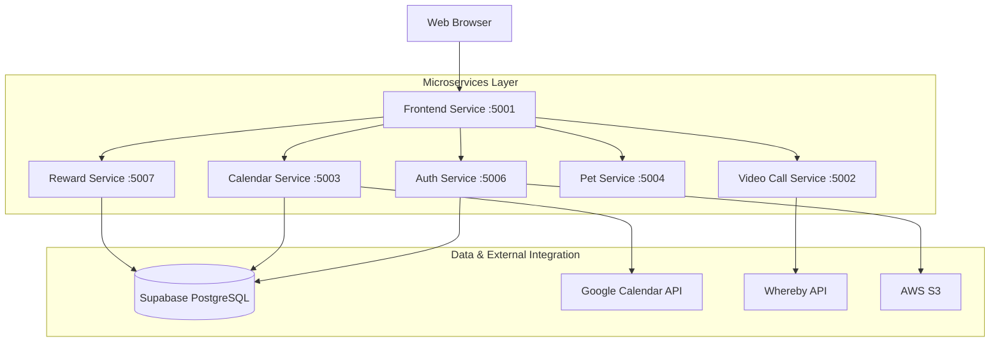

# AIDA: Assisted Independent Daily Activities

## Project Overview
AIDA is a cloud-native microservices-based system designed to support Persons with Intellectual Disability (PWIDs) in completing and tracking Activities of Daily Living (ADLs) such as self-care routines and household tasks. The system empowers users through gentle guidance, smart reminders, and engaging digital interactions—including a virtual pet motivator and a rewards mechanism that reinforces consistent task completion.

Beyond supporting PWIDs, AIDA provides MINDS staff and volunteers with robust tools to manage client profiles, configure personalized task support, and provide real-time assistance via video and voice communication. Built with a modular and scalable architecture, AIDA is designed for long-term usability, ethical AI integration, and flexible deployment across various care environments.

## Problem Statement
PWIDs often face significant challenges in managing daily routines independently, which can impact their autonomy and overall well-being. Existing monitoring solutions often rely on invasive methods (e.g., constant camera surveillance) that compromise privacy and dignity within the home.

**AIDA addresses this central challenge:**
> How might we use technology to support and empower PWIDs in completing and tracking their daily tasks, without unnecessarily infringing on the privacy of their home environment?

## Architecture & Architecture Decision Records (ADR)
AIDA utilizes a cloud-native microservices architecture to ensure high availability, fault isolation, and the ability to scale components independently.

### System Architecture




### Architectural Decisions
- **Gateway Pattern**: The `Frontend-service` acts as a reverse proxy, centralizing request routing and simplifying client-side API configuration.
- **Stateless Authentication**: JWT (JSON Web Tokens) are used across all services to ensure secure, stateless communication.
- **Service Isolation**: Each core feature (Auth, Calendar, Video, etc.) is encapsulated in its own service, allowing for independent updates and technological flexibility.


## Key Features
- 🐾 **Digital Pet Motivator**: An interactive virtual pet that encourages task completion and reflects the user's progress through dynamic mood states (Happy, Bored, Dirty, Playing) with animated sprite assets.
- 📅 **Smart Task Management**: Personalized task scheduling with routine support, bulk task creation, drag-to-reorder, and weekly/monthly calendar views. Includes AI-powered schedule generation and task completion statistics.
- 🤖 **AI-Assisted Guidance**: Context-aware conversational companion powered by Google Gemini, with intelligent nudges, intent detection, and guided task-by-task walkthroughs via dedicated wake, task, and transition screens.
- 🎁 **Gamified Rewards**: Users earn points for completing tasks with category-based tracking, a global leaderboard, and a redemption store for real-world or digital rewards.
- 📹 **Remote Support**: Scheduled staff check-in calls and client-initiated emergency calls via Whereby, with call status tracking and history management.
- 🎙️ **Voice Companion**: Hands-free voice interaction via Google Cloud Speech-to-Text and pyttsx3 Text-to-Speech, enabling users to converse with AIDA naturally using local audio hardware.
- 🔐 **Role-Based Access Control**: Secure JWT authentication with bcrypt password hashing, supporting distinct Staff, Client, and Admin roles with tailored dashboards and permissions.
- 👥 **Staff Management Portal**: Tools for staff to register and manage client profiles, upload profile images to S3 storage, and configure personalized accessibility settings.
- 🍓 **Raspberry Pi Kiosk Mode**: Deployable as a standalone kiosk on a Raspberry Pi for always-on, hands-free access to the AI companion in full-screen Chromium.
- 🎨 **Accessibility-First Design**: A clean, glassmorphism-inspired UI designed specifically for ease of use and cognitive clarity, with configurable accessibility settings per user.


## Tech Stack
| Layer | Technology |
|-------|-----------|
| **Frontend** | HTML5, Vanilla JavaScript (ES6+), CSS3 with Glassmorphism Design |
| **Backend (Node.js)** | Express.js, http-proxy-middleware, jsonwebtoken (JWT), bcrypt, multer, pg, cors, dotenv |
| **Backend (Python)** | Flask, Flask-CORS, Requests, python-dotenv |
| **AI & Voice** | Google Generative AI SDK (`google-genai`), SpeechRecognition, pyttsx3, PyAudio |
| **Database** | PostgreSQL (hosted on Supabase) |
| **Object Storage** | Supabase S3 Storage via AWS SDK (`@aws-sdk/client-s3`) — profile images |
| **Containerization** | Docker, Docker Compose |
| **Edge Device** | Raspberry Pi (Chromium kiosk mode, Bash setup scripts) |
| **External APIs** | Whereby (video calls), Google Gemini (LLM), Google Cloud Speech-to-Text |

## Assumptions / Limitations
- **Stakeholder Involvement**: We assume MINDS staff will carry out regular check-ins with the PWIDs at their accommodation to ensure their well-being and safety.
- **Connectivity**: Users are assumed to have access to a basic digital device and stable internet connectivity.
- **Self-Reporting**: Task completion is currently self-reported. The system intentionally avoids intrusive monitoring (sensors/cameras) to prioritize user privacy.
- **AI Integration**: AI features are strictly assistive and supportive, designed to aid decision-making rather than act autonomously.
- **Prototype Status**: The system is a functional prototype and may require further performance tuning for large-scale production deployment.

## Setup Instructions
1. **Clone the repository**
   ```bash
   git clone https://github.com/HRx88/AIDA.git
   cd AIDA
   ```
2. **Environment Configuration**
   Create a `.env` file in the root directory and populate it with the following variables. These are shared across all microservices:

   ```env
   # Database (Supabase PostgreSQL)
   SUPABASE_USER=postgres
   SUPABASE_PASS=your_password
   SUPABASE_HOST=db.your-project.supabase.co
   SUPABASE_DB=postgres

   # Security
   JWT_SECRET=your_super_secret_jwt_key

   # Service Ports
   FRONTEND_PORT=5001
   VIDEO_SERVICE_PORT=5002
   CALENDAR_SERVICE_PORT=5003
   PET_SERVICE_PORT=5004
   AUTH_SERVICE_PORT=5006
   REWARD_SERVICE_PORT=5007

   # Video Communication (Whereby)
   WHEREBY_API_KEY=your_whereby_api_key

   # Storage (AWS S3)
   AWS_ACCESS_KEY_ID=your_aws_access_key
   AWS_SECRET_ACCESS_KEY=your_aws_secret_key
   AWS_S3_REGION=ap-southeast-1
   AWS_S3_BUCKET=your-bucket-name

   # Google Calendar Integration
   GOOGLE_CLIENT_ID=your_google_client_id
   GOOGLE_CLIENT_SECRET=your_google_client_secret
   GOOGLE_REDIRECT_URI=http://localhost:5001/calendar/api/google-calendar/callback
   ```

3. **Build and Run**
   ```bash
   docker-compose up --build
   ```
4. **Access the Application**
   The frontend is accessible at `http://localhost:5001`.

### Database Schema

Run the following SQL script in your database (e.g., Supabase SQL Editor) to set up the required tables and test data:

```sql
-- ==========================================
-- 1. DROP EXISTING TABLES (Reset)
-- ==========================================
DROP TABLE IF EXISTS reward_redemptions;
DROP TABLE IF EXISTS user_points;
DROP TABLE IF EXISTS task_logs;
DROP TABLE IF EXISTS tasks;
DROP TABLE IF EXISTS schedules;
DROP TABLE IF EXISTS video_calls;
DROP TABLE IF EXISTS rewards;
DROP TABLE IF EXISTS users;

-- ==========================================
-- 2. CREATE CORE TABLES
-- ==========================================

-- Users Table
CREATE TABLE IF NOT EXISTS users (
    id SERIAL PRIMARY KEY,
    username VARCHAR(50) UNIQUE NOT NULL,
    email VARCHAR(255), -- Added column
    password_hash VARCHAR(255) NOT NULL,
    full_name VARCHAR(100),
    role VARCHAR(20) NOT NULL CHECK (role IN ('staff', 'client', 'admin')),
    profile_image_url TEXT,
    accessibility_settings JSONB DEFAULT '{}',
    created_at TIMESTAMP DEFAULT CURRENT_TIMESTAMP
);

-- Rewards Table
CREATE TABLE IF NOT EXISTS rewards (
    id SERIAL PRIMARY KEY,
    name VARCHAR(120) NOT NULL,
    description TEXT,
    cost_points INTEGER NOT NULL,
    stock INTEGER,
    fulfilment_type VARCHAR(20) NOT NULL DEFAULT 'pickup',
    pickup_location VARCHAR(255),
    image_url TEXT,
    is_active BOOLEAN NOT NULL DEFAULT TRUE,
    created_at TIMESTAMP WITH TIME ZONE NOT NULL DEFAULT NOW(),
    CONSTRAINT rewards_cost_points_check CHECK (cost_points > 0),
    CONSTRAINT rewards_stock_check CHECK (stock >= 0)
);

-- ==========================================
-- 3. CREATE DEPENDENT TABLES
-- ==========================================

-- Schedules Table
CREATE TABLE IF NOT EXISTS schedules (
    id SERIAL PRIMARY KEY,
    user_id INTEGER REFERENCES users(id) ON DELETE CASCADE,
    week_start DATE NOT NULL,
    created_by VARCHAR(20) DEFAULT 'user',
    is_template BOOLEAN DEFAULT FALSE,
    created_at TIMESTAMP DEFAULT NOW(),
    updated_at TIMESTAMP DEFAULT NOW()
);

-- Tasks Table
CREATE TABLE IF NOT EXISTS tasks (
    id SERIAL PRIMARY KEY,
    schedule_id INTEGER REFERENCES schedules(id) ON DELETE CASCADE,
    user_id INTEGER REFERENCES users(id) ON DELETE CASCADE,
    title VARCHAR(255) NOT NULL,
    description TEXT,
    day_of_week INTEGER NOT NULL,
    time_slot TIME,
    category VARCHAR(50) DEFAULT 'general',
    is_routine BOOLEAN DEFAULT FALSE,
    order_index INTEGER DEFAULT 0,
    created_at TIMESTAMP DEFAULT NOW(),
    updated_at TIMESTAMP DEFAULT NOW()
);

-- Reward Redemptions Table
CREATE TABLE IF NOT EXISTS reward_redemptions (
    id SERIAL PRIMARY KEY,
    user_id INTEGER NOT NULL REFERENCES users(id) ON DELETE CASCADE,
    reward_id INTEGER NOT NULL REFERENCES rewards(id) ON DELETE CASCADE,
    quantity INTEGER NOT NULL DEFAULT 1,
    points_spent INTEGER NOT NULL,
    fulfilment_type VARCHAR(20) NOT NULL,
    status VARCHAR(20) NOT NULL DEFAULT 'pending',
    recipient_name VARCHAR(120),
    recipient_phone VARCHAR(30),
    address_line1 VARCHAR(255),
    address_line2 VARCHAR(255),
    postal_code VARCHAR(20),
    recipient_email VARCHAR(255),
    voucher_code VARCHAR(50),
    redeemed_at TIMESTAMP WITH TIME ZONE NOT NULL DEFAULT NOW(),
    CONSTRAINT reward_redemptions_points_spent_check CHECK (points_spent > 0),
    CONSTRAINT reward_redemptions_quantity_check CHECK (quantity > 0)
);

-- Task Logs Table
CREATE TABLE IF NOT EXISTS task_logs (
    id SERIAL PRIMARY KEY,
    task_id INTEGER REFERENCES tasks(id) ON DELETE SET NULL,
    user_id INTEGER REFERENCES users(id) ON DELETE CASCADE,
    scheduled_date DATE NOT NULL,
    completed_at TIMESTAMP DEFAULT NOW(),
    status VARCHAR(20) DEFAULT 'done',
    notes TEXT
);

-- User Points Table
CREATE TABLE IF NOT EXISTS user_points (
    id SERIAL PRIMARY KEY,
    user_id INTEGER REFERENCES users(id) ON DELETE CASCADE,
    points INTEGER NOT NULL,
    reason VARCHAR(255),
    task_id INTEGER REFERENCES tasks(id) ON DELETE SET NULL,
    created_at TIMESTAMP DEFAULT NOW()
);

-- Video Calls Table
CREATE TABLE IF NOT EXISTS video_calls (
    id SERIAL PRIMARY KEY,
    staff_id INTEGER REFERENCES users(id),
    client_id INTEGER REFERENCES users(id) NOT NULL,
    room_url TEXT,
    host_url TEXT,
    call_type VARCHAR(20) CHECK (call_type IN ('checkin', 'emergency')),
    scheduled_time TIMESTAMP,
    emergency_reason TEXT,
    notes TEXT,
    status VARCHAR(20) DEFAULT 'scheduled' CHECK (status IN ('scheduled', 'urgent', 'active', 'completed', 'cancelled')),
    created_at TIMESTAMP DEFAULT CURRENT_TIMESTAMP,
    updated_at TIMESTAMP
);

-- ==========================================
-- 4. INDEXES
-- ==========================================
CREATE INDEX IF NOT EXISTS idx_redemptions_user_id ON reward_redemptions(user_id);
CREATE INDEX IF NOT EXISTS idx_tasks_user_id ON tasks(user_id);
CREATE INDEX IF NOT EXISTS idx_user_points_user_id ON user_points(user_id);

-- ==========================================
-- 5. TEST DATA
-- ==========================================
INSERT INTO users (username, email, password_hash, full_name, role) VALUES
('staff_admin', 'admin@example.com', 'staff123', 'Staff Admin', 'staff'),
('alex_client', 'alex@example.com', 'client123', 'Alex Chen', 'client')
ON CONFLICT (username) DO NOTHING;
```

---

## Docker Guide

AIDA is fully containerized using Docker, allowing for consistent deployment across different environments.

### Prerequisites
- [Docker Desktop](https://www.docker.com/products/docker-desktop/) installed and running.
- [Docker Compose](https://docs.docker.com/compose/install/) (included with Docker Desktop).

### Deployment Steps
1. **Configure Environment**: Ensure your `.env` file in the root directory contains all required secrets (database credentials, API keys).
2. **Build & Launch**: Run the following command to build images and start all services in detached mode:
   ```bash
   docker-compose up --build -d
   ```
3. **Verify Status**: Check if all services are healthy:
   ```bash
   docker-compose ps
   ```
4. **View Logs**: Monitor specific service logs (e.g., auth service):
   ```bash
   docker-compose logs -f auth-service
   ```
5. **Stop Services**:
   ```bash
   docker-compose down
   ```

---

## Voice Server (Host Setup)
The Voice Server runs **outside Docker** on the host machine to access local microphone and speaker hardware. It must be started separately.
### Prerequisites
- Python 3.10+ installed
- A working microphone and speaker connected to the host machine
- [PyAudio](https://pypi.org/project/PyAudio/) requires PortAudio system libraries:
  - **Windows**: No extra steps — `pip install` handles it
  - **macOS**: `brew install portaudio`
  - **Linux**: `sudo apt-get install portaudio19-dev python3-pyaudio`
### Setup & Run
1. **Install dependencies** (from the project root):
   ```bash
   pip install -r requirements.txt
   ```
2. **Start the Voice Server**:
   ```bash
   python -m app.main
   ```
3. **Verify**: The server should be running on `http://localhost:5000`. The AI Service (Docker) connects to it via `host.docker.internal:5000`.
> [!IMPORTANT]
> The Voice Server **must** be running before using any voice features (STT/TTS) in the AI Companion.
---
## Raspberry Pi Kiosk Deployment (Optional)
The AI Companion can be deployed as a standalone kiosk on a Raspberry Pi for hands-free, always-on interaction.
### Prerequisites
- Raspberry Pi 4 (or later) with Raspberry Pi OS
- Network connectivity to the host machine running Docker services
- Speaker and microphone connected to the RPi
### Setup
1. **Copy setup files** to the RPi:
   ```bash
   scp -r rpi/ pi@<rpi-ip>:~/aida-kiosk/
   ```
2. **Run the setup script** on the RPi:
   ```bash
   cd ~/aida-kiosk
   chmod +x setup.sh kiosk.sh
   ./setup.sh
   ```
3. **Launch kiosk mode**:
   ```bash
   ./kiosk.sh
   ```
   This opens Chromium in full-screen kiosk mode, pointed at the AI Service's wake page.
> [!NOTE]
> Ensure the host machine's IP and ports (`5010` for AI, `5000` for Voice) are accessible from the RPi's network.
---

## Postman Guide

AIDA APIs can be tested directly using Postman. All microservices are proxied through the **Frontend Service (Port 5001)** for ease of use.

### Authentication
Most endpoints require a **Bearer Token**.
1. **Login**: Send a `POST` request to `http://localhost:5001/auth/api/auth/login`.
2. **Retrieve Token**: Copy the `token` from the response.
3. **Authorize**: In Postman, go to the **Auth** tab, select **Bearer Token**, and paste the token.

### Key API Endpoints
> All endpoints are proxied through the **Frontend Service** (`localhost:5001`) unless noted otherwise.
#### Auth Service (`/auth/api/auth/...`)
| Endpoint | Method | Description |
|:---|:---|:---|
| `/auth/api/auth/login` | `POST` | Authenticate and receive JWT |
| `/auth/api/auth/change-password` | `PUT` | Change current user's password |
| `/auth/api/auth/update-profile` | `PUT` | Update current user's profile |
| `/auth/api/auth/upload-avatar` | `POST` | Upload profile image (→ S3) |
| `/auth/api/auth/users` | `GET` | List all users (Staff only) |
| `/auth/api/auth/users` | `POST` | Register a new user |
| `/auth/api/auth/users/:id` | `GET` | Get user by ID |
| `/auth/api/auth/users/:id` | `PUT` | Update user by ID |
| `/auth/api/auth/users/:id/avatar` | `POST` | Upload avatar for a specific user |
#### Calendar Service (`/calendar/api/...`)
| Endpoint | Method | Description |
|:---|:---|:---|
| `/calendar/api/tasks/` | `POST` | Create a new task |
| `/calendar/api/tasks/bulk` | `POST` | Bulk-create multiple tasks |
| `/calendar/api/tasks/day/:userId/:date` | `GET` | Get tasks for a user on a date |
| `/calendar/api/tasks/month/:userId/:year/:month` | `GET` | Get tasks for a user by month |
| `/calendar/api/tasks/routines/:userId` | `GET` | Get routine tasks for a user |
| `/calendar/api/tasks/:id` | `GET` | Get a single task |
| `/calendar/api/tasks/:id` | `PUT` | Update a task |
| `/calendar/api/tasks/:id` | `DELETE` | Delete a task |
| `/calendar/api/tasks/:id/reorder` | `PUT` | Reorder task position |
| `/calendar/api/schedules/` | `POST` | Create a new schedule |
| `/calendar/api/schedules/user/:userId` | `GET` | Get schedules by user |
| `/calendar/api/schedules/current/:userId` | `GET` | Get current week schedule |
| `/calendar/api/schedules/generate/:userId` | `POST` | AI-generate a schedule |
| `/calendar/api/schedules/:id` | `GET` / `PUT` / `DELETE` | CRUD on a schedule |
| `/calendar/api/logs/complete` | `POST` | Mark a task as completed |
| `/calendar/api/logs/today/:userId` | `GET` | Get today's completion status |
| `/calendar/api/logs/user/:userId/date/:date` | `GET` | Get logs by date |
| `/calendar/api/logs/user/:userId/week/:weekStart` | `GET` | Get logs by week |
| `/calendar/api/logs/stats/:userId` | `GET` | Get completion statistics |
| `/calendar/api/points/:userId` | `GET` | Get points balance |
| `/calendar/api/points/:userId/history` | `GET` | Get points history |
| `/calendar/api/points/:userId/breakdown` | `GET` | Points breakdown by category |
| `/calendar/api/points/leaderboard/all` | `GET` | Global leaderboard |
#### Reward Service (`/rewards/api/rewards/...`)
| Endpoint | Method | Description |
|:---|:---|:---|
| `/rewards/api/rewards/items` | `GET` | List available rewards |
| `/rewards/api/rewards/redeem` | `POST` | Redeem a reward |
| `/rewards/api/rewards/me` | `GET` | Get current user's redemption history |
#### Video Call Service (`/calls/api/calls/...`)
| Endpoint | Method | Description |
|:---|:---|:---|
| `/calls/api/calls/checkin` | `POST` | Schedule a staff check-in call |
| `/calls/api/calls/emergency` | `POST` | Trigger an emergency call |
| `/calls/api/calls/staff/:staffId` | `GET` | Get calls for a staff member |
| `/calls/api/calls/client/:clientId` | `GET` | Get calls for a client |
| `/calls/api/calls/:callId` | `GET` | Get call by ID |
| `/calls/api/calls/:callId` | `PUT` | Update a call |
| `/calls/api/calls/:callId` | `DELETE` | Delete a call |
| `/calls/api/calls/:callId/status` | `PATCH` | Update call status |
| `/calls/api/calls/cleanup` | `POST` | Clean up stale calls |
#### Pet Service (`/pet/api/pet/...`)
| Endpoint | Method | Description |
|:---|:---|:---|
| `/pet/api/pet/mood` | `GET` | Get digital pet's current mood |
#### AI Service (Port `5010` — direct access)
| Endpoint | Method | Description |
|:---|:---|:---|
| `/api/ai_reply` | `POST` | Send user text, get AI companion response + intent |
| `/api/ai_nudge` | `POST` | Get a motivational nudge from the AI |
| `/api/stt_once` | `POST` | Speech-to-Text (proxied to Voice Server) |
| `/api/tts` | `POST` | Text-to-Speech (proxied to Voice Server) |
| `/wake` | `GET` | Wake-up companion UI page |
| `/task` | `GET` | Task execution UI page |
| `/task-transition` | `GET` | Task transition UI page |
#### Voice Server (Port `5000` — host only)
| Endpoint | Method | Description |
|:---|:---|:---|
| `/api/stt_once` | `POST` | Capture microphone audio → text |
| `/api/tts` | `POST` | Convert text → speaker audio |

> [!TIP]
> Use the environment variable `{{base_url}} = http://localhost:5001` in Postman to switch between local and production environments easily.


